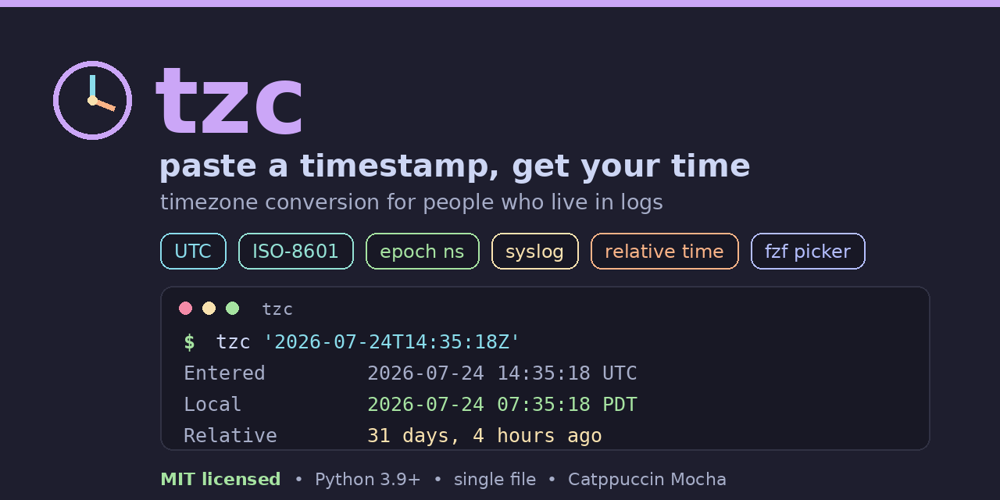

<!-- Set this image as your repo's social preview: Settings > General > Social preview -->
<p align="center">
  
</p>

<h1 align="center">tzc</h1>

<p align="center">
  
  
  
  
  
</p>

<p align="center"><b>Paste a timestamp, get your local time. Nothing else to think about.</b></p>

---

## Why

Most logs are stamped in **UTC**. When you are staring at an error line, you do
not want to do timezone math in your head. `tzc` is built for exactly that: copy
the timestamp straight out of the log, paste it in, and it tells you what time
that actually was for you, plus how long ago it happened.

It works the other way too. Someone in a different timezone drops a timestamp in
chat ("it broke at 14:35"), and you just paste it in and convert it into your
own timezone without a second thought.

And because your day probably revolves around a handful of the same zones, you
can wrap `tzc` in a couple of **shell aliases** so a conversion is one short
word away.

`tzc` reads basically any timestamp you are likely to copy (SQL, ISO-8601 /
Kubernetes, syslog, Apache, `date` output, Unix epoch in seconds through
nanoseconds, and even plain-English "31 days, 4 hours, 25 minutes ago"), lets
you pick the target zone with an `fzf` fuzzy search, and prints the result in a
clean Catppuccin-colored block.

---

## Features

- **Paste and go** - auto-detects roughly a dozen timestamp formats, so you
  rarely have to tell it anything about the input
- **UTC and offset aware** - `Z`, `+02:00`, and named abbreviations (UTC, PST,
  IST, JST, ...) are all understood
- **Unix epoch in any resolution** - seconds, milliseconds, microseconds, or
  nanoseconds, detected automatically
- **Human-readable relative input** - type `31 days, 4 hours, 25 minutes ago` or
  `in 3 hours` and it resolves against now
- **fzf timezone picker** - fuzzy-search the full IANA list, annotated with each
  zone's abbreviation and current UTC offset (search `IST` or `-8h`)
- **Tells you how long ago** - every result includes a friendly relative time
  like `31 days, 4 hours ago`
- **Shell-alias friendly** - pass `--to` to skip the picker and bake your common
  conversions into one-word aliases
- **Readable output** - Catppuccin Mocha colors that auto-disable when piped or
  when `NO_COLOR` is set
- **Single file, standard library only** - the one optional extra is `fzf`, and
  even that has a plain-text fallback

---

## Requirements

- **Python 3.9+** (uses the standard-library `zoneinfo` module)
- **[fzf](https://github.com/junegunn/fzf)** for the interactive timezone
  picker. Optional: if `fzf` is not installed, or you pass `--to`, `tzc` falls
  back to a plain text prompt or that value.
- **IANA tz database** - present on macOS and most Linux systems. On a minimal
  install you may need it from PyPI: `pip install tzdata`.

No third-party Python packages are required.

---

## Installation

```bash
# grab the script, name it tzc, make it executable, and put it on your PATH
curl -o tzc https://raw.githubusercontent.com/bytebeast/tzc/main/tzc
chmod +x tzc
mv tzc ~/.local/bin/    # or anywhere on your PATH, e.g. /usr/local/bin

# fzf is recommended for the picker
brew install fzf        # macOS
sudo apt install fzf    # Debian / Ubuntu
```

Then just run `tzc`.

---

## Usage

```
tzc [options] [timestamp]
tzc                       # prompts for a timestamp, then opens the fzf picker
```

### Examples

```bash
# The core use: paste a UTC log line's timestamp, pick your zone in fzf
tzc "2026-07-24T14:35:18Z"

# Skip the picker by naming the target zone
tzc "2026-07-24 14:35:18" --to America/New_York

# A teammate pasted their local time in chat; convert it to yours
tzc "Fri Jul 24 07:19:59 PDT 2026" --to Europe/London

# Naive log timestamp with no zone in it - tell tzc it is UTC
tzc "2026-07-24 14:35:18" --from UTC --to Asia/Tokyo

# Unix epoch (seconds, millis, micros, or nanos - auto-detected)
tzc 1721831718 --to Australia/Sydney
tzc 1721831718123456789 --to UTC

# syslog / systemd style (year is assumed to be the current year)
tzc "Jul 24 14:35:18" --to Europe/Paris

# Apache / Nginx access-log timestamp
tzc "24/Jul/2026:14:35:18 +0000" --to America/Chicago

# Plain-English relative time, resolved against now
tzc "31 days, 4 hours, 25 minutes ago" --to UTC
tzc "in 3 hours" --to Asia/Kolkata

# Disable colors (also respects the NO_COLOR convention)
tzc "2026-07-24T14:35:18Z" --to UTC --no-color
```

### The fzf picker

Run `tzc` with no `--to` and you get a fuzzy-searchable list of every IANA zone,
each line annotated with its abbreviation(s) and current UTC offset:

```
Asia/Kolkata                    IST         +5:30
America/New_York                EST/EDT     -4h
Europe/London                   GMT/BST     +1h
```

Search by zone name (`tokyo`), by abbreviation (`IST` surfaces India, Ireland,
and Israel so you can pick the right one), or even by offset (`-8h`).

---

## Shell aliases

Because you convert to the same few zones all day, wrap them up. Add these to
your `~/.bashrc` or `~/.zshrc`:

```bash
# one-word conversions to your common zones
# --- Americas ---
alias tzsfo='tzc --to America/Los_Angeles'   # SFO  San Francisco
alias tzsea='tzc --to America/Los_Angeles'   # SEA  Seattle
alias tzaus='tzc --to America/Chicago'       # AUS  Austin
alias tzjfk='tzc --to America/New_York'      # JFK  New York
alias tzyyz='tzc --to America/Toronto'       # YYZ  Toronto
 
# --- Europe / Middle East ---
alias tzlhr='tzc --to Europe/London'         # LHR  London
alias tzber='tzc --to Europe/Berlin'         # BER  Berlin
alias tztlv='tzc --to Asia/Jerusalem'        # TLV  Tel Aviv
 
# --- Asia / Pacific ---
alias tzblr='tzc --to Asia/Kolkata'          # BLR  Bengaluru
alias tzszx='tzc --to Asia/Shanghai'         # SZX  Shenzhen
alias tzsin='tzc --to Asia/Singapore'        # SIN  Singapore
alias tzhnd='tzc --to Asia/Tokyo'            # HND  Tokyo
alias tzsyd='tzc --to Australia/Sydney'      # SYD  Sydney

# usage: tzsfo "2026-07-24T14:35:18Z"
```

Prefer functions so you can convert whatever is on your clipboard in one shot:

```bash
# macOS (pbpaste) - convert the copied timestamp to New York time
tznow() { tzc "$(pbpaste)" --to America/New_York; }

# Linux with xclip - convert the clipboard to your local zone
tzhere() { tzc "$(xclip -o -selection clipboard)"; }
```

Now copy a timestamp out of a log, run `tznow`, and you are done.

---

## Recognized input formats

| Input example                      | Source                       |
| ---------------------------------- | ---------------------------- |
| `2026-07-24 14:35:18`              | SQL databases, apps (naive)  |
| `2026-07-24T14:35:18Z`             | APIs, Kubernetes (UTC)       |
| `2026-07-24T14:35:18.123Z`         | Cloud-native apps (UTC)      |
| `2026-07-24T14:35:18+02:00`        | ISO-8601 with offset         |
| `Jul 24 14:35:18`                  | Linux syslog (year assumed)  |
| `Jul 24 14:35:18.123`              | systemd, Java (year assumed) |
| `Fri Jul 24 07:19:59 UTC 2026`     | Unix `date` command output   |
| `1721831718`                       | Unix epoch seconds           |
| `1721831718123`                    | Unix epoch milliseconds      |
| `1721831718123456789`              | Unix epoch nanoseconds       |
| `24/Jul/2026:14:35:18 +0000`       | Apache / Nginx access log    |
| `31 days, 4 hours, 25 minutes ago` | Human-readable relative time |
| `in 3 hours, 12 minutes`           | Human-readable relative time |

Naive timestamps (no zone in the string) are assumed to be in your **local**
timezone unless you pass `--from`.

---

## Options

| Flag          | Description                                                    |
| ------------- | -------------------------------------------------------------- |
| `--to ZONE`   | Target timezone; skips the fzf picker (e.g. `--to Asia/Tokyo`) |
| `--from ZONE` | Timezone to assume for naive inputs (default: your local zone) |
| `--no-color`  | Disable the Catppuccin colored output                          |

Output includes the parsed input, the entered time, the converted time, the UTC
equivalent, the Unix epoch, and a friendly relative time.

---

## License

[MIT](LICENSE)
